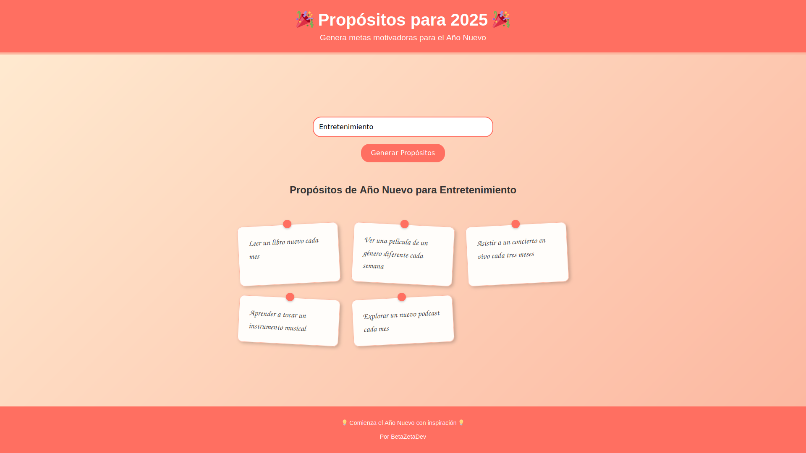

# New Year Resolution Generator 🎉

An interactive web application that helps users generate inspiring New Year resolutions based on a chosen topic. Powered
by ChatGPT, this app uses a user-friendly interface and stylish design to deliver motivation for the upcoming year.

## Features

- Generate 5 personalized New Year resolutions based on your chosen topic.
- Responsive design for a seamless experience on any device.
- Stylish "handwritten notes" UI for displaying resolutions.



## Technologies Used

- **Frontend**: HTML, CSS, JavaScript
- **Backend**: Node.js, Express
- **API**: OpenAI ChatGPT
- **Styling**: Fully responsive with modern design principles
- **Containerization**: Docker for both frontend and backend services.

## Installation

1. Clone the repository:
   ```bash
   git clone https://github.com/betazetadev/new-year-resolution-generator
   cd new-year-resolution-generator
    ```
   
2. Build and run the Docker containers:
   ```bash
   docker compose up --build
   ```

3. Visit `http://localhost:8080` in your browser to access the application.

## Usage

1. Enter a topic in the input field (e.g., "Health," "Technology").
2. Click the "Generate Resolutions" button.
3. View your `personalized` resolutions displayed as stylish handwritten notes.

## Environment Variables

To run this application, you need an OpenAI API key. Create a `.env` file in the `backend` folder and add the following:

```plaintext
OPENAI_API_KEY=your-openai-api-key
```